<!-- TABLE OF CONTENTS -->
## Table of Contents

* [About the Project](#about-the-project)
  * [Built With](#built-with)
* [Getting Started](#getting-started)
  * [Prerequisites](#prerequisites)
  * [Installation](#installation)
* [Design](#design)
* [Acknowledgements](#acknowledgements)


<!-- ABOUT THE PROJECT -->
## About The Project


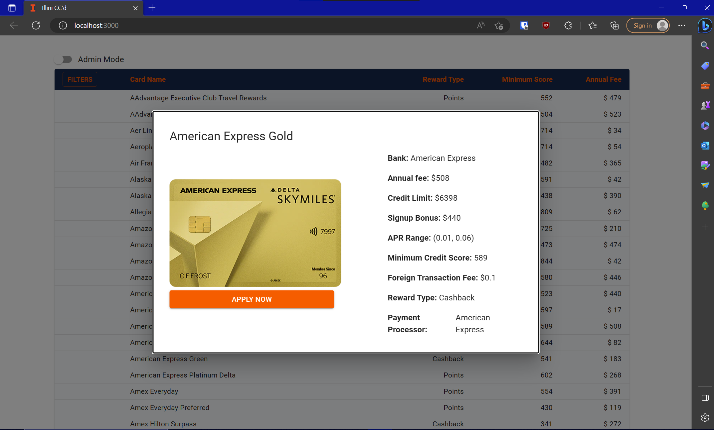


This is a web interface (frontend with backend) integrated with a database for credit cards.

*[DEMO](https://youtu.be/w8gRLMfLC-Q)


### Built With

mySQL was used for the database schema. nodejs with express was used for the backend. React was used for the frontend. Python was used to scrape credit card names and generate fake data for each card.
The decision to generate fake data was made to save time so that the website and database could be developed to a high level before making the arduous task to collection data for hundreds of cards that would probably be out of date within 2 years.

* [mySQL workbench](https://www.mysql.com/products/workbench/)
* [nodejs](https://nodejs.org/en)
* [React](https://react.dev/)
* [WSL](https://en.wikipedia.org/wiki/Windows_Subsystem_for_Linux)


<!-- GETTING STARTED -->
## Getting Started


### Prerequisites

You need:

1. Nodejs and node package manager (npm, xpm)
2. mySQL workbench or a mySQL package
3. Windows Subsystem for Linux (WSL)

### Installation

WSL is used to run the frontend and backend
Follow this tutorial to install WSL: https://learn.microsoft.com/en-us/windows/wsl/install

mySQL workbench is used to run the SQL server. 
You can run a mySQL server using WSL too, but this tutorial assumes you are using mySQL workbench.
Follow the instructions here for windows: https://dev.mysql.com/downloads/windows/installer/.

Download the "Developer Default".

If you have to name the database at any point, choose "illini-cc" as the name, otherwise you will need to change the "DEV_DB_NAME" variable in the ".env" file in the backend to match.

Remember the password you set, the "DEV_DB_PASSWORD" variable in the ".env" file in the backend has to match what you set.

Once you finish installing and setting up the local SQL instance using mySQL workbench so you see this screen:

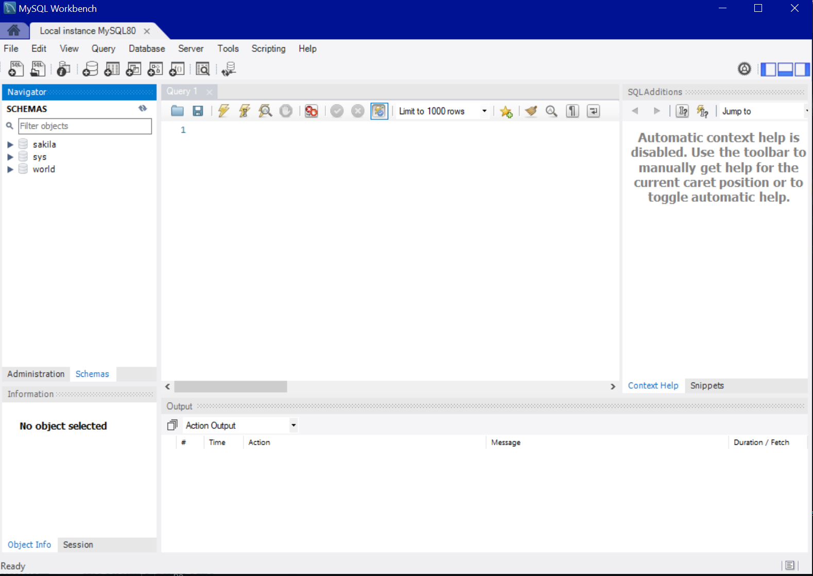

Click the folder in the query window:

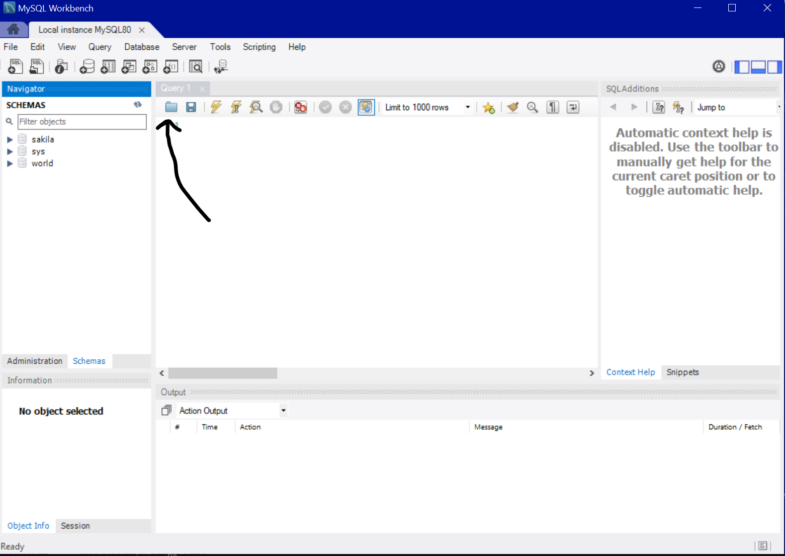

Open the "schema.sql" file in the sql folder. Then click on the lightnig bolt to execute the script.

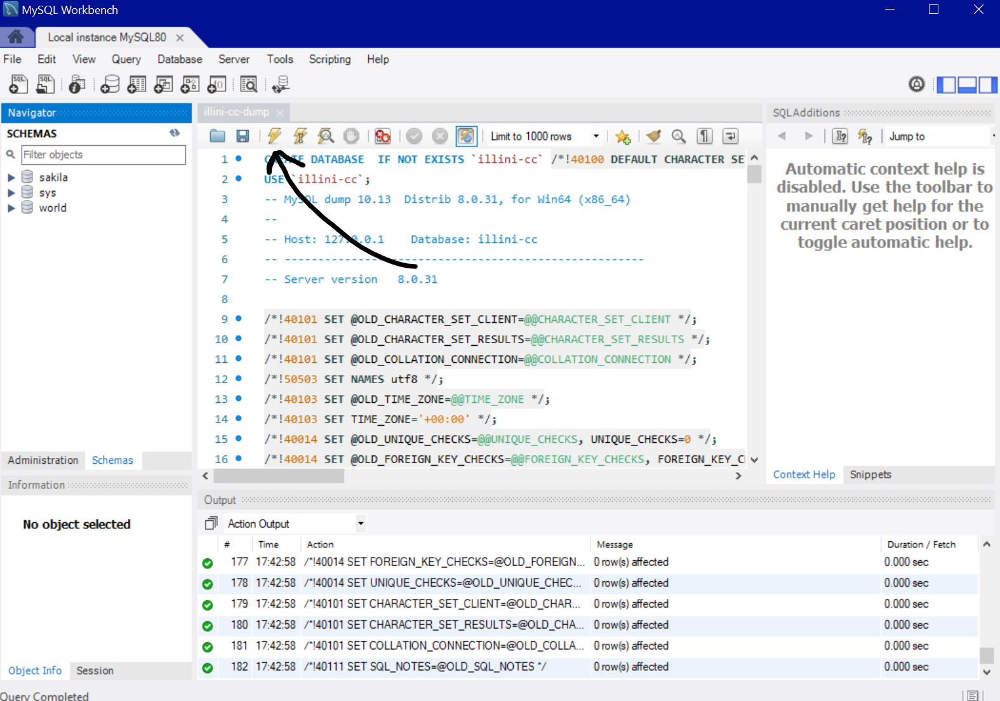

make sure the tables now exist by pressing the refresh button in the schemas window:

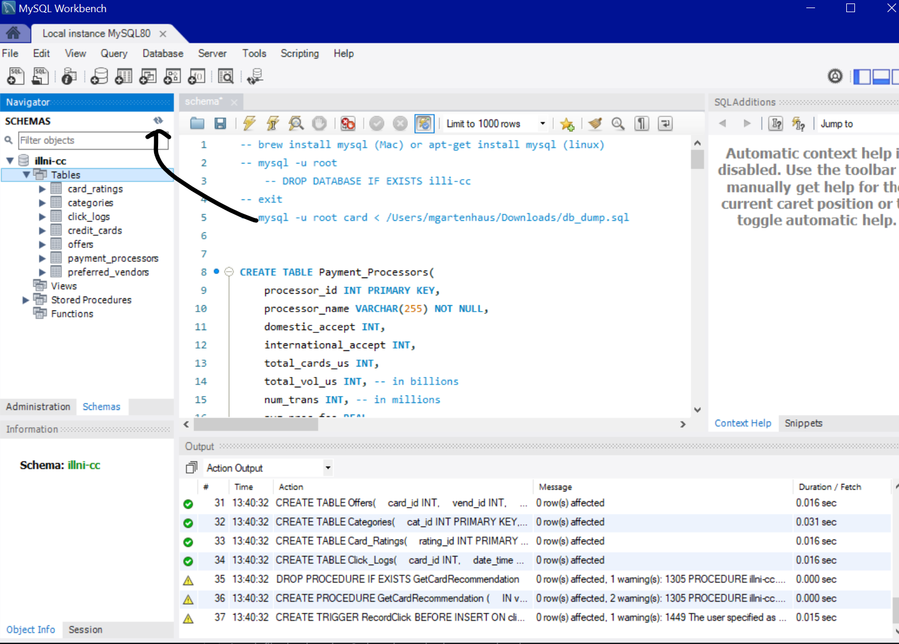

Now open the "illini-cc-dump.sql" file in the sql folder. Then click the lightning bolt again.
Check to make sure data was added by opening a new sql tab and executing the following command "SELECT * From credit_cards"

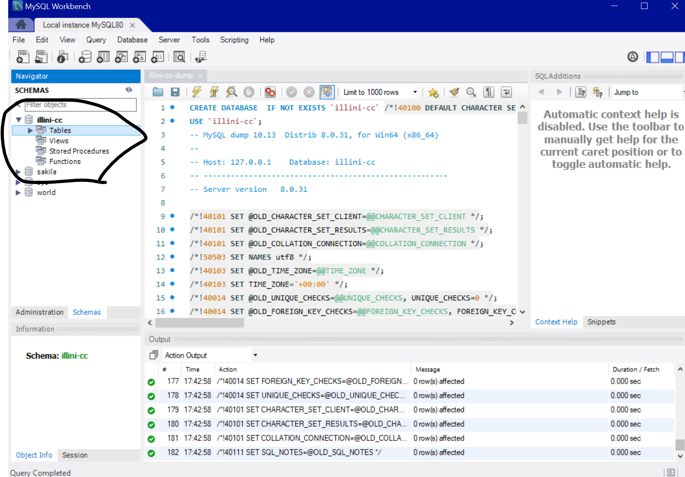

Now we have to allow connections from our WSL backend. Click on "Server->Users and Privileges"

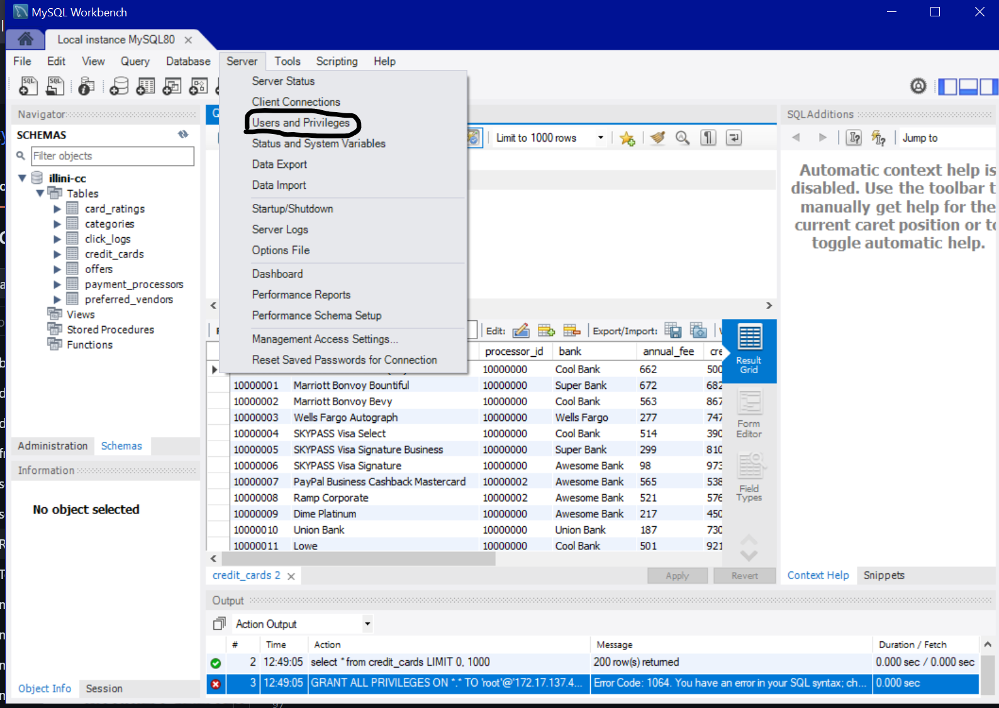

click on the "root" user and change "Limit to Hosts matching:" to the ip address of your WSL connection. Or just use "%" to allow all connections.

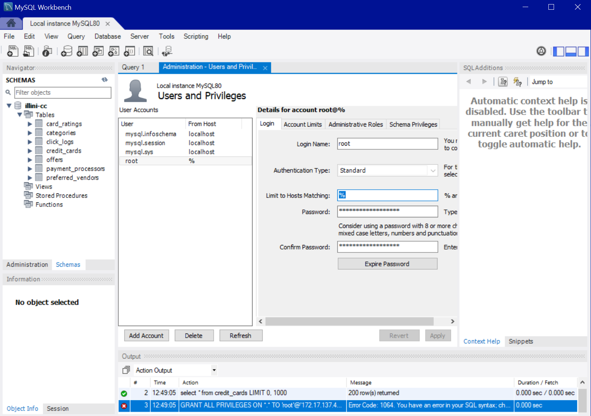

This completes the sql database setup.

Next we need to change the ".env" file in the backend. Change the DEV_DB_HOST to your WSL's ip address.

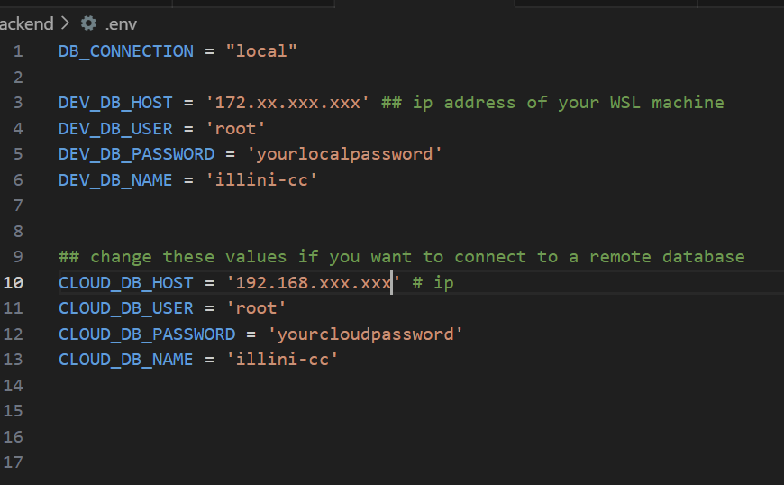

to download nodejs, follow the instructions here: https://github.com/nodesource/distributions

Once you have nodejs, run the following command in the "backend" folder:
```
npm install
```


Once this is done you can run the following command (also in backend) to start the backend:

```
npm start
```

The same command can be used in the "frontend" folder (in a different terminal):

```
npm install
npm start
```

note that you only have to run "npm install" once, then to start any other time, just run "npm start"

The frontend should open up automatically at "http://localhost:3000".


# Design

The frontend and backend allow us to add, delete, modify and search cards in the database. 

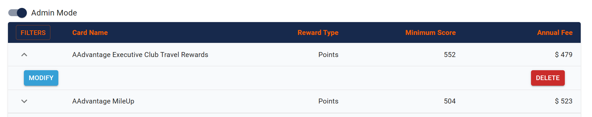

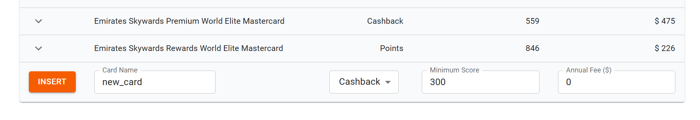

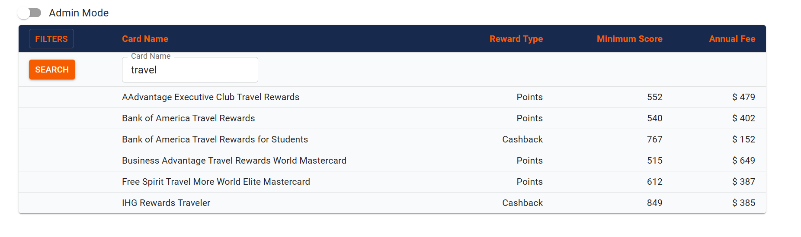

The database also keeps track of how many times a card is clicked on and the website uses these statistics to show you the current trending cards and also shows a graph of the most viewed (clicked) cards.

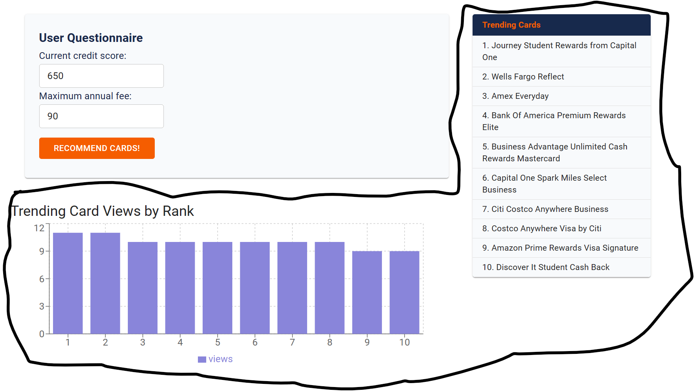


<!-- ACKNOWLEDGEMENTS -->
## Acknowledgements
* [Readme Template](https://github.com/othneildrew/Best-README-Template)


