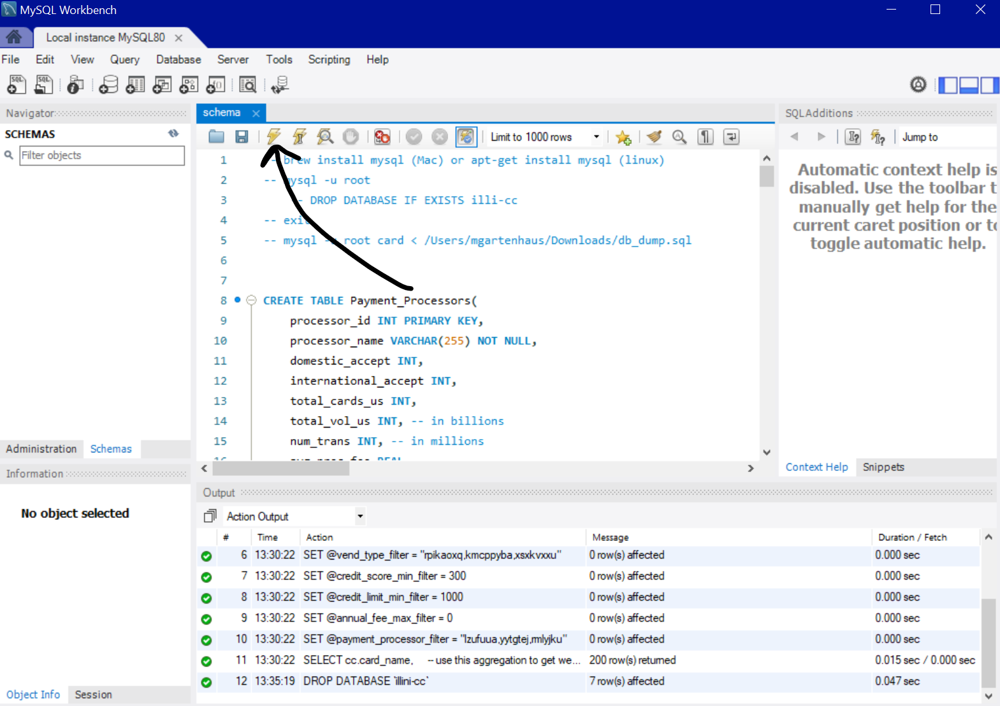
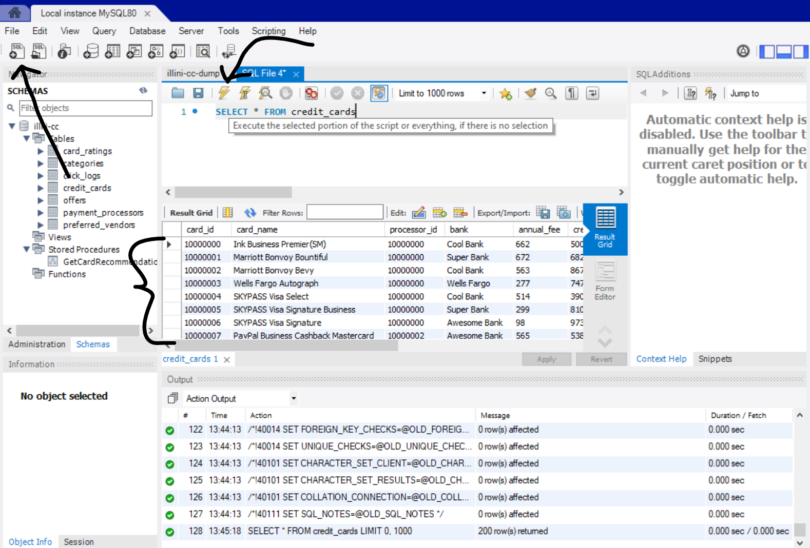

<!-- TABLE OF CONTENTS -->
## Table of Contents

* [About the Project](#about-the-project)
  * [Built With](#built-with)
* [Getting Started](#getting-started)
  * [Prerequisites](#prerequisites)
  * [Installation](#installation)
* [Design](#design)
* [Acknowledgements](#acknowledgements)


<!-- ABOUT THE PROJECT -->
## About The Project

![picture here]


This is a web interface (frontend with backend) integrated with a database for credit cards.

*[DEMO](https://youtu.be/w8gRLMfLC-Q)


### Built With

mySQL was used for the database schema. nodejs with express was used for the backend. React was used for the frontend. Python was used to scrape credit card names and generate fake data for each card.
The decision to generate fake data was made to save time so that the website and database could be developed to a high level before making the arduous task to collection data for hundreds of cards that would probably be out of date within 2 years.

* [mySQL workbench](https://www.mysql.com/products/workbench/)
* [nodejs](https://nodejs.org/en)
* [React](https://react.dev/)
* [WSL](https://en.wikipedia.org/wiki/Windows_Subsystem_for_Linux)


<!-- GETTING STARTED -->
## Getting Started


### Prerequisites

You need:

1. Nodejs and node package manager (npm, xpm)
2. mySQL workbench or a mySQL package
3. Windows Subsystem for Linux (WSL)

### Installation

WSL is used to run the frontend and backend
Follow this tutorial to install WSL: https://learn.microsoft.com/en-us/windows/wsl/install

mySQL workbench is used to run the SQL server. 
You can run a mySQL server using WSL too, but this tutorial assumes you are using mySQL workbench.
Follow the instructions here for windows: https://dev.mysql.com/downloads/windows/installer/.

Download the "Developer Default".

If you have to name the database at any point, choose "illini-cc" as the name, otherwise you will need to change the "DEV_DB_NAME" variable in the ".env" file in the backend to match.

Remember the password you set, the "DEV_DB_PASSWORD" variable in the ".env" file in the backend has to match what you set.

Once you finish installing and setting up the local SQL instance using mySQL workbench so you see this screen:


Click the folder in the query window:


open the "illini-cc-dump.sql" file in the sql folder. Then click the lightning bolt to execute the script:



then click the refresh button in the schemas window:


Make sure the Illini-cc database shows up:



This completes the sql database setup.

to download nodejs, follow the instructions here: https://github.com/nodesource/distributions

Once you have nodejs, run the following command:
```
npm install
```

Once this is done you can run the following command in the "backend" folder to start the backend:

```
npm start
```

The same command can be used in the "frontend" folder (in a different terminal):

```
npm install
npm start
```

note that you only have to run "npm install" once, then to start any other time, just run "npm start"

Once both the frontend and backend are running, you should be able to see the website running on port 3000. 
Just go to this url: "http://localhost:3000".

# Design


<!-- ACKNOWLEDGEMENTS -->
## Acknowledgements
* [Readme Template](https://github.com/othneildrew/Best-README-Template)


